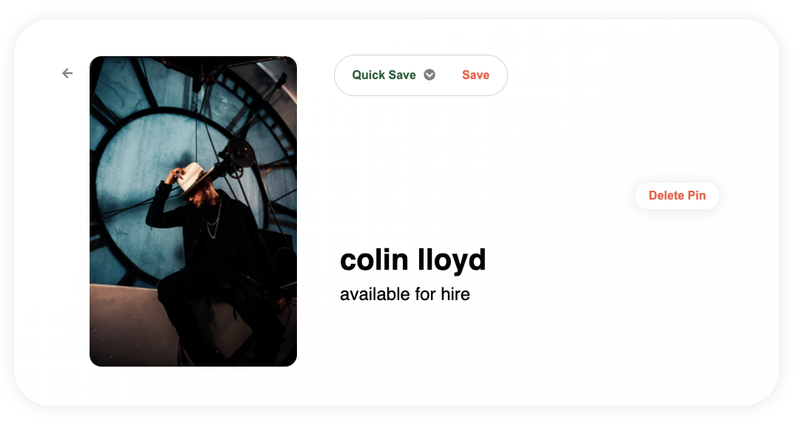

# mooboo

## 1. Overview
mooboo (abbr. mood board) is a fully function full stack clone of the popular
'inspiration' board web app Pinterest.

mooboo is built with a React frontend, and a Ruby-On-Rails backend. The client server and remote server communite using REST-API routes.

The database is a PostGres SQL database, with image hosting through AWS S3.

### Live Site: [Mooboo](mooboo.io)

## 2. Key Features

* User Authentication / Demo User:
    New users are created and assigned a password using the BCrypt gem utilizing 
    the blowfish hashing algorithm.

* Pin Index:
    One of the key features of the app is the 'masonry grid' style layout which is 
    a ubiquitous feature of Pinterest. 
    

* Pins:
    Users have the ability to create pins, and save them to boards. Users can also
    delete pins that they have created
    

* Boards:
    Users have the ability to create and edit boards and save pins to the created boards. Users can also delete remove pins from their created boards as well as delete the boards
    entirely.
    

* Follows:
    Users can follow and unfollow one another.

## 3. Challenges

