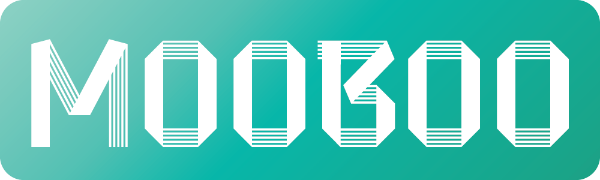
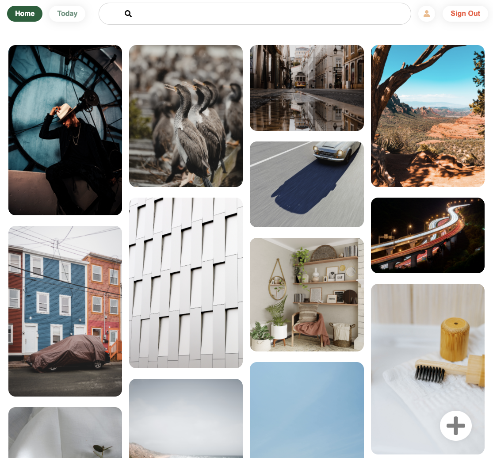

<!-- Project Sheilds -->
[![Ruby][RubyBadgeURL]](RubyURL)
[![Rails][RailsBadgeURL]](RailsURL)
[![JavaScript][JavaScriptBadgeURL]](JavaScriptURL)
[![React][ReactBadgeURL]](ReactURL)
[![Redux][ReduxBadgeURL]](ReduxURL)
[![LinkedIn][linkedin-shield]][linkedin-url]
<!-- Project Header -->

<div align='center'> 
    <a href='https://mooboo.io/#/' target='_blank'>
        
    </a>
    <h1 align='center' style='font-weight:700; font-size:40px; border:none'>mooboo</h1>
    <p align='center' 
    style='display:flex; flex-direction:row; justify-content:center; align-items:center; font-weight:700'
    >
    <a href='https://mooboo.io/#/' target='_blank' style='margin:5px'>Live Site</a>
    ·
    <a href='https://github.com/theomantz/mooboo/issues'style='margin:5px'>Report A Bug</a>
    ·
    <a href='https://github.com/theomantz/mooboo/issues'style='margin:5px'>Request Feature</a>
  </p>
</div>

<details open='open'> 
  <summary>Table of Contents</summary>
  <ol>
    <li>
      <a href="#about-the-project">About The Project</a>
      <ul>
        <li><a href="#built-with">Built With</a></li>
        <li><a href="#the-process">The Process</a></li>
        <li><a href="#key-features">Key Features</a></li>
      </ul>
    </li>
    <li>
      <a href="#getting-started">Getting Started</a>
      <ul>
        <li><a href="#prerequisites">Prerequisites</a></li>
        <li><a href="#installation">Installation</a></li>
      </ul>
    </li>
    <li><a href="#roadmap">Roadmap</a></li>
    <li><a href="#contact">Contact</a></li>
    <li><a href="#acknowledgements">Acknowledgements</a></li>
  </ol>
</details>

## About the Project
<div align='center'>

</div>
<strong>mooboo</strong> (abbr. mood board) is a fully functional full-stack clone of the popular
'inspiration' website Pinterest.

### Built With

* [Ruby-on-Rails](RailsURL)
* [JavaScript](JavaScriptURL)
* [React](ReactURL)

### The Process

* Coming Soon...

### Key Features

* User Authentication / Demo User:
    New users are created and assigned a password using the BCrypt gem utilizing 
    the blowfish hashing algorithm.

* Pin Index:
    One of the key features of the app is the 'masonry grid' style layout which is 
    a ubiquitous feature of Pinterest. 
    

* Pins:
    Users have the ability to create pins, and save them to boards. Users can also
    delete pins that they have created
    

* Boards:
    Users have the ability to create and edit boards and save pins to the created boards. Users can also delete remove pins from their created boards as well as delete the boards
    entirely.
    

* Follows:
    Users can follow and unfollow one another.

## Getting Started

### Prerequisites

* Ruby v. 2.5.1
* Rails v. 5.2.5

### Installation

1. Clone the repo:
```sh
git clone https://github.com/theomantz/mooboo.git
```

2. Bundle Install:
```sh
bundle install
```

3. Install NPM packages:
```sh
npm install
```

4. Start node server:
```sh
npm run start
```

5. Start rails server:
```sh
rails s
```


## Roadmap

See the [open issues](https://github.com/theomantz/mooboo/issues) for proposed features and bugs.

## Contact

Email Me: theo@mantz.io

## Acknowledgements
* [Pinterest](https://www.pinterest.com/)

<!-- Badge URLS -->
[RubyBadgeURL]: https://img.shields.io/badge/uses-ruby-red?style=for-the-badge
[RubyURL]: https://www.ruby-lang.org/en/
[RailsBadgeURL]: https://img.shields.io/badge/uses-rails-red?style=for-the-badge
[RailsURL]: https://rubyonrails.org/
[ReactBadgeURL]: https://img.shields.io/badge/uses-react-blue?style=for-the-badge
[ReactURL]: https://reactjs.org/
[JavaScriptBadgeURL]: https://img.shields.io/badge/USES-JavaScript-yellow?style=for-the-badge
[JavaScriptURL]: https://developer.mozilla.org/en-US/docs/Web/JavaScript
[ReduxBadgeURL]: https://img.shields.io/badge/USES-Redux-Blue?style=for-the-badge
[ReduxURL]: https://redux.js.org/
[linkedin-shield]: https://img.shields.io/badge/-LinkedIn-black.svg?style=for-the-badge&logo=linkedin&colorB=555
[linkedin-url]: https://linkedin.com/in/theo-mantz